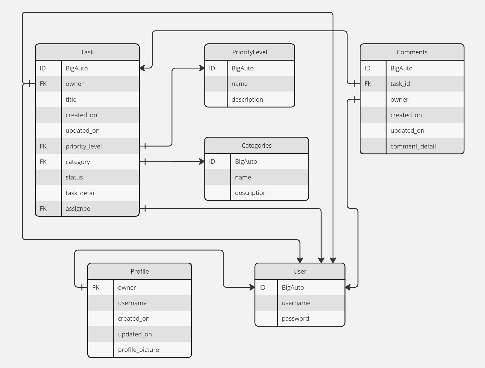
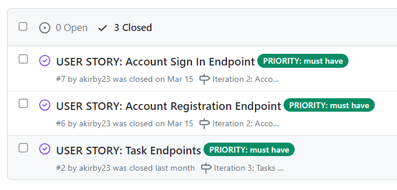
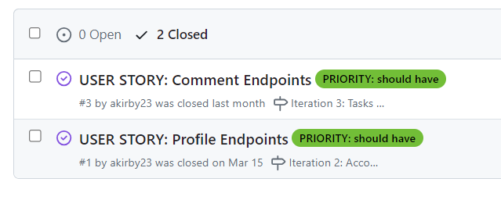
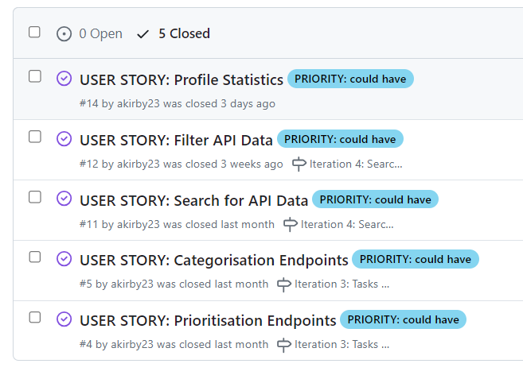
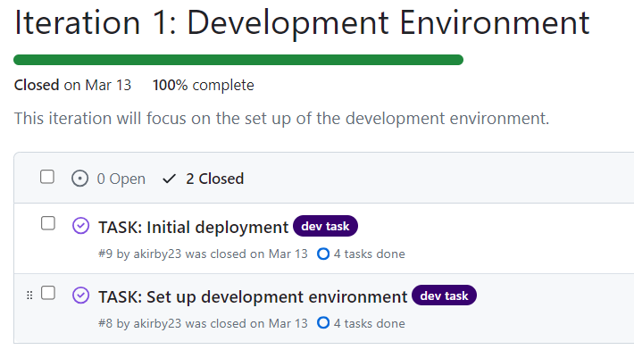
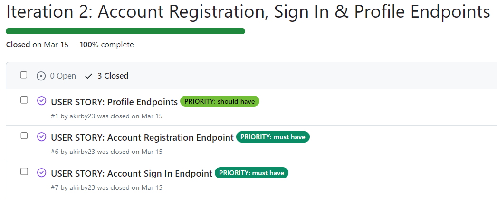
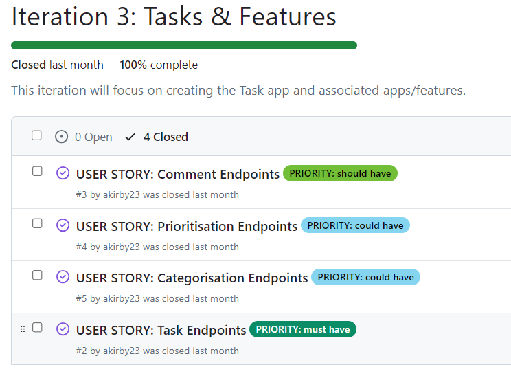
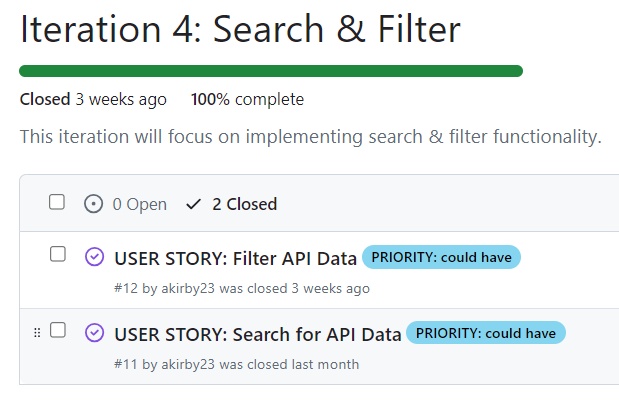
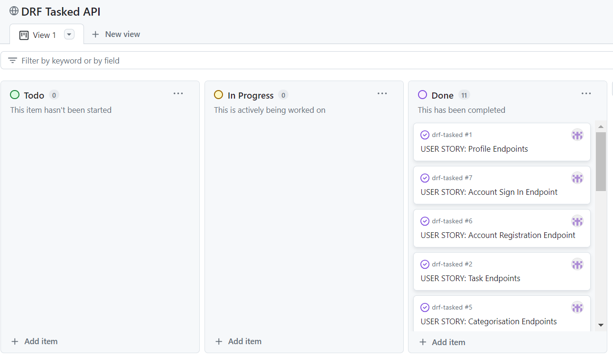

# DRF Tasked API

DRF Tasked is a Django Rest Framework API that offers task management functionality. 
It has been designed as a foundation for the [Tasked](https://github.com/akirby23/tasked/) app, however it could be used for other similar task management applications. 

The API offers user authentication, full CRUD (Create, Read, Update, Delete) functionality for tasks and comments, search & filter options to allow users to find the data they need easily and categorisation & prioritisation to allow users to manage their tasks effectively.

[DRF Tasked live link](https://drf-tasked-ec51bc3bfc2d.herokuapp.com/)

## Table of Contents

- [Features](#features)
- [Database Design](#database)
- [Agile Methodology](#agile-methodology)
- [Technologies Used](#technologies-used)
    - [Languages](#languages)
    - [Frameworks, Libraries & Programs](#frameworks-libraries--programs)
- [Testing](#testing)
- [Deployment](#deployment)
- [Credits](#credits)

## Features

- **User Authentication:** Users can sign up, log in & log out. User profiles are created automatically upon sign up.
- **Tasks:** Authenticated users can create & read tasks. Task owners/assignees can edit and delete their tasks. 
- **Task Categorisation:** Authenticated users can assign categories to tasks upon task creation & by editing their tasks. Admin users can add new categories to the database.
- **Task Prioritisation:** Authenticated users can assign priority levels to tasks upon task creation & by editing their tasks. Admin users can add new priority levels to the database.
- **Task Status assignment:** By default, tasks are set to "In Progress" status upon creation. Task owners/assignees can change the status to "Completed" once they have completed the task.
- **Commenting:** Authenticated users can comment on their own & other user's tasks. Comment owner's can edit & delete their comments.
- **Task Assignment:** Authenticated users can assign tasks to other users upon task creation or by editing the task. 
- **User Profiles:** Authenticated users can access user profiles. Profile owners can edit their own profiles.
- **Search & Filter:** Users can search for tasks by category name or by title. Tasks can be filtered by owner, category, priority level & status.
- **Timestamps:** Created on & updated on timestamps are available on tasks, comments & profiles.

## Database Design  

### Models

Task

|  Name | Field Type  |  Validation | Notes  |    
|---|---|---|---|
| owner  | ForeignKey  | on_delete=models.CASCADE | One-to-one relationship to the User model  |
| title  | CharField  | max_length=100  |   |
| created_on  | DateTimeField  | auto_now_add=True  |   |
| updated_on  | DateTimeField  | auto_now=True  |   |
| category  | ForeignKey  | on_delete=models.CASCADE  | ForeignKey relationship to the Category model  |
| priority_level  | ForeignKey  | on_delete=models.CASCADE | ForeignKey relationship to the PriorityLevel model   |
| task_detail  | TextField  | max_length=500  |   |
| assignee  | ForeignKey  | on_delete=models.SET_NULL, null=True, related_name='assignee'  | ForeignKey relationship to the User model   |
| status  | CharField  | max_length=50, choices=TASK_STATUS, default='IN_PROGRESS'  | TASK_STATUS = [('IN_PROGRESS', 'In Progress'),('COMPLETED', 'Completed')]  |

Comment

|  Name | Field Type  |  Validation | Notes  |      
|---|---|---|---|
| owner  | ForeignKey  | on_delete=models.CASCADE  | ForeignKey relationship to the User model  |
| task | ForeignKey  | on_delete=models.CASCADE  | ForeignKey relationship to the Task model  |
| created_on  | DateTimeField  | auto_now_add=True  |   |
| updated_on  | DateTimeField  | auto_now=True  |   |
| comment_detail  | TextField  | max_length=500  |   |

Profile

|  Name | Field Type  |  Validation | Notes  |      
|---|---|---|---|
| owner  | OneToOneField  | on_delete=models.CASCADE  | One-to-one relationship to the User model   |
| username  | CharField  | max_length=150, blank=True  |   |
| created_on  | DateTimeField  | auto_now_add=True  |   |
| updated_on  | DateTimeField  | auto_now=True  |   |
| content  | TextField  | max_length=450, blank=True  |   |
| profile_picture | ImageField  |   |   |

Category

|  Name | Field Type  |  Validation | Notes  |       
|---|---|---|---|
| name  | CharField  | max_length=100  |   |
| description | TextField | max_length=100  |   |

Priority Level

|  Name | Field Type  |  Validation | Notes  |    
|---|---|---|---|
| name  | CharField  | max_length=100  |
| description | TextField | max_length=100  |

User

Django AllAuth model, which has not been modified.

|  Name | Field Type  |  Validation | Notes  |    
|---|---|---|---|
| username  | CharField  | Default Django AllAuth validation  |   |
| password |  CharField | Default Django AllAuth validation  |   |

### Database Scheme

The models above have been designed based on this Entity Relationship Diagram:

## Agile Methodology

The drf-tasked API was developed using an Agile approach.

- User stories were prioritised using the MoSCoW method:

| Priority Level | Description  |
|---|---|
| `must-have ` | Essential features  |
| `should-have` | Important but not absolutely essential features  |
| `could-have ` | Nice to have but not essential features  |
| `wont-have`  | Non essential features, may be implemented in the future |

- GitHub Issues was used to document & to prioritise each of the user stories.

- The user stories were refined & actioned in 4 different iterations using GitHub milestones: 

| Iteration | Screenshot |
|---|---|
| Iteration 1: Development Environment  |   |
| Iteration 2: Account Registration, Sign In & Profile Endpoints |   | 
| Iteration 3: Tasks & Features |   | 
| Iteration 4: Search & Filter  |   | 

A [GitHub project](https://github.com/users/akirby23/projects/6) was used to manage & track the progress of the app's development:

## Technologies Used

### Languages

- Python

### Frameworks, Libraries & Programs

- [Django](https://www.djangoproject.com/) to build the API.
- [Django REST Framework](https://www.django-rest-framework.org/) to build the API.
- [Django AllAuth](https://docs.allauth.org/en/latest/) for user authentication.
- [Django-cors-headers](https://pypi.org/project/django-cors-headers/) for handling the server headers required for Cross-Origin Resource Sharing (CORS).
- [Cloudinary](https://console.cloudinary.com/) to host the images.
- [Pillow](https://pypi.org/project/pillow/) for image processing.
- [ElephantSQL](https://customer.elephantsql.com/signup): to host the PostgreSQL database.
- [PostgreSQL](https://www.postgresql.org/) as the object-relational database.
- [Heroku](https://www.heroku.com/) to deploy the API.
- [Git](https://git-scm.com/) for version control.
- [GitHub](https://github.com/) for storing the code in its repository.
- [GitPod](https://gitpod.io/) for writing the code.

## Testing

All testing details are documented within the [TESTING.md](TESTING.md) file.

## Deployment

### Heroku Deployment

This application has been deployed to Heroku using the following steps:

#### Create the app
1. Create a Heroku account on [heroku.com](https://heroku.com/)
2. From the top right hand corner of the dashboard, click "New", then click "Create new app".
3. Give the app a unique name and select the relevant region.
4. Click "Create app".

#### Create the database 

This app requires the use of a PostgreSQL database. 

To obtain your own database:

1. Navigate to [elephantSQL.com](https://customer.elephantsql.com/) or alternative PostreSQL hosting service and register for an account. 
2. Click on "Create New Instance".
3. Name your database and select the "Tiny Turtle (Free)" plan. 
4. Click "Select Region", and on the next page, select your preferred region. 
5. Once you've created your instance, click on the name of the instance to access the database URL & password.

#### Cloudinary

This app uses Cloudinary to store images online. 

To obtain your Cloudinary key:

1. Navigate to [cloudinary.com](https://cloudinary.com/) and create an account. 
2. Navigate to the dashboard to obtain your API Environment Variable.
3. When copying the API Environment Variable, be sure to remove the "CLOUDINARY_URL=" from the start of the URL.

#### Set the Config Vars

From the settings tab on the app dashboard, navigate to "Config Vars and click "Reveal Config Vars".

Set them as follows:

| Key | Value | 
| --- | --- |
| CLOUDINARY_URL| Your Cloudinary URL |
| DATABASE_URL| Your own database URL |
| DISABLE_COLLECTSTATIC | 1 (temporary step, to be removed before deployment)
| SECRET_KEY | Your own secret key |

#### Prepare required files
- In your preferred IDE, install the project's requirements by running the following command:
  `pip3 install -r requirements.txt`
- Create a Procfile within the root directory.
- In the procfile, add the following code: web: `gunicorn PROJ_NAME.wsgi`
   - Replace the PROJ_NAME with your own main Django app name.
- Push the changes to GitHub. 

#### Deploy to Heroku

- Navigate to the "Deploy" tab. 
- Link the GitHub repository in the Deployment Method section. 
- Deploy manually or enable automatic deploys if you would prefer. 
- If any errors occur during deployment, the build logs can be used to troubleshoot them.

The app will now be live.

### Local Deployment

- Create an env.py file in the root directory if there isn't one already. 
- Ensure to add the env.py file to your .gitignore file <u>before</u> commiting or pushing to GitHub to prevent credentials from being exposed. 
- Add `import.os` to the top of the env.py file. 
- Add your secret key, Cloudinary URL & database URL in this format: 
 
`os.environ.["SECRET_KEY] = "YOUR_SECRET_KEY"`
 
`os.environ.["CLOUDINARY_URL"] = "YOUR_URL"`
 
`os.environ.["DATABASE_URL] = "YOUR_URL"`
- Add your environment variables to the settings.py file. 

Note: Ensure to set "DEBUG" to "False" in production or during deployment.

#### Forking the repository

1. Navigate to the [drf-tasked GitHub repository](https://github.com/akirby23/drf-tasked).
2. At the top right-hand corner of the page, click on "Fork".
3. Rename or change the description if you wish.
4. Click "Create Fork".
5. A copy of the original repository should now appear on your GitHub account.

#### Cloning the repository

1. Navigate to the [drf-tasked GitHub repository](https://github.com/akirby23/drf-tasked).
2. Navigate to the "<> Code" button and click on it.
3. Choose your preferred cloning option (HTTPS, SSH or GitHub CLI).
4. Open Git Bash or Terminal.
5. Change the current working directory to the location where you want the cloned directory.
6. In your terminal, enter the following command to clone the drf-tasked repository:
     ``git clone https://github.com/akirby23/drf-tasked``
7. Press enter to create a local clone in your preferred IDE.

## Credits 

- [Django](https://docs.djangoproject.com/en/5.0/) & [Django REST Framework](https://www.django-rest-framework.org/) documentation were consulted regularly throughout the development of the API. 
- Code Institute's drf-api walkthrough project was also consulted for guidance during the development of the API.
- Credit to [andreagrandi](https://gist.github.com/andreagrandi/14e07afd293fafaea770f69cf66cac14) for the IsAdminOrReadOnly permission class.
- Default profile picture was obtained from [mostkingto on Vecteezy](https://www.vecteezy.com/vector-art/20765399-default-profile-account-unknown-icon-black-silhouette).

[Back to the top](#drf-tasked-api)

